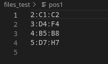
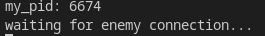
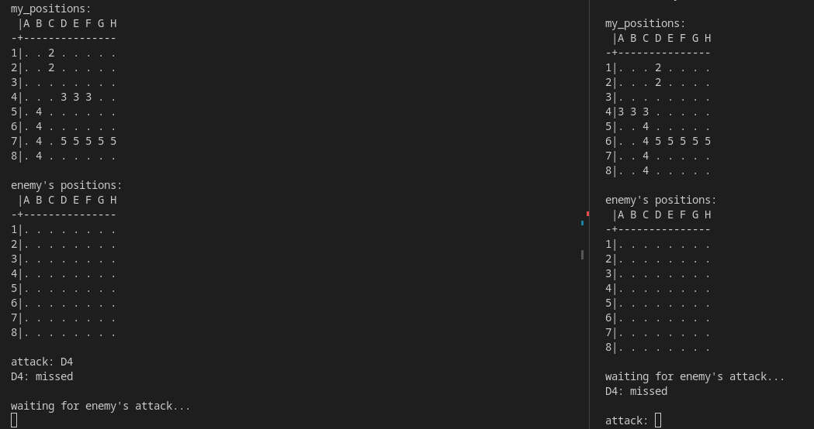

# My_navy
The My_navy is a project that was done in groups of two over a period of three weeks in C language. 
The goal is to create a naval battle with two terminals using signals. 
The program takes a script to place all ships on the map. 

---
## Installation and usage

To use it, follow the instructions below: 
- Clone the repository by entering the following command in your terminal:

        git@github.com:nathanbaudelin/My_navy.git

- Once inside the cloned folder, compile the project by entering the command:

        make re

- Run the program by entering these commands:

    - On the fisrt terminal (player):

            ./navy ship_positions

            ship_positions      file representing the positions of the ships.

    - On the second terminal (player):

            ./navy first_player_pid navy_positions

            first_player_pid    pid of the first player.
            ship_positions      file representing the positions of the ships.

#### Example
I have a script file:

The player 1 wants to place his ships in the positions of the pos1 file. He must type the command:

        ./navy files_test/pos1

After that he get his PID:

The player two can place his ships in the positions of the pos2 file and connect with player 1. He must type the command:

        ./navy 6674 files_test/pos2

Finally you get the map and player 1 can play by choosing these attack coordinates :

Now, You know how to play, so may the best win !

---

## Contributors

[Nathan Baudelin](https://github.com/nathanbaudelin) 
[Pierre Giordano](https://github.com/giordano-pierre)
